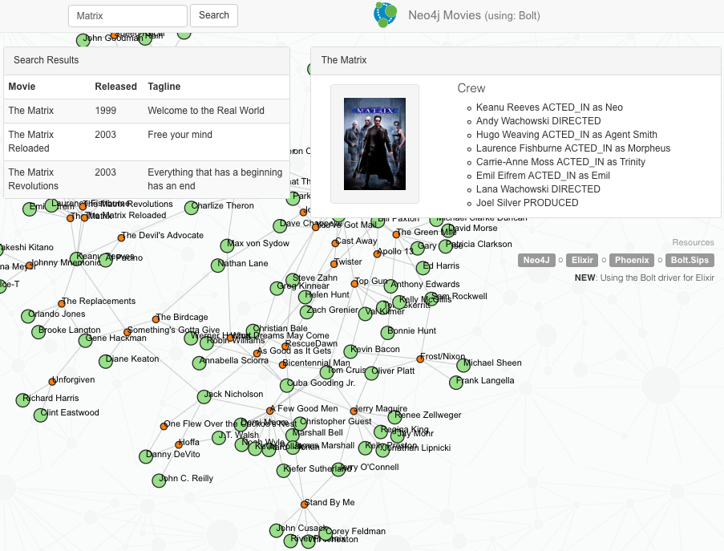

## The Movies Example Application

A very simple web application using [Neo4j](http://neo4j.com/developer/get-started/) with [Elixir](http://elixir-lang.org), [Phoenix](http://www.phoenixframework.org), and: [Bolt.Sips](https://github.com/florinpatrascu/bolt_sips); an Elixir driver for Neo4j's Bolt network protocol.

### The Stack

These are the components of our Web Application:

- Application type: [Elixir](http://elixir-lang.org) [Phoenix](http://www.phoenixframework.org) web application
- Web framework: [Phoenix](http://www.phoenixframework.org)
- Persistence Access: [Bolt.Sips](https://github.com/florinpatrascu/bolt_sips)
- Database: [Neo4j](http://neo4j.com/developer/get-started/) Server
- Frontend: jquery, bootstrap

### Prerequisites

- [Elixir](http://elixir-lang.org) and  [Phoenix](http://www.phoenixframework.org)
- a local (or remote) Neo4j graph database server. This demo will connect to a local Neo4j server instance, available at: `localhost`, with the Bolt protocol enabled on port: `7687` 
- the Neo4j Movie Database. Open the [Neo4j Browser](http://localhost:7474).
Then install the Movies dataset with `:play movies`, click and hit the "Run" button.


## Install

    $ git clone https://github.com/florinpatrascu/bolt_movies_elixir_phoenix
    $ cd bolt_movies_elixir_phoenix
    $ mix do deps.get, deps.compile

### Configure the access to your Neo4j server

Edit the `config/config.exs` and describe the Neo4j server endpoint, example:

```elixir
config :bolt_sips, Bolt,
  hostname: 'localhost',
  port: 7687,
  pool_size: 10,
  max_overflow: 5
```

If your server requires basic authentication, add this to your config file:

  basic_auth: [username: "neo4j", password: "*********"],

more details and examples, here: [Bolt.Sips](https://github.com/florinpatrascu/bolt_sips)

### Run

Start the Phoenix server:

    $ cd bolt_movies_elixir_phoenix
    $ mix phoenix.server

Point your browser to: `http://localhost:4000`, and you'll see the following "welcome" screen:



Click on the movie names, to see the cast and the roles for each member of the crew. Or just search movies by typing in a partial name, i.e. `atlas`, `apollo`, and so on.

#### Extras
Oh, oh, and some HTTP REST **endpoints** too, of course :)

    # JSON object for single movie with cast
    $ curl -H "Accept:application/json" \
      http://localhost:4000/movies/findByTitle?title=The%20Matrix

    # list of JSON objects for movie search results
    $ curl -H "Accept:application/json" \
      http://localhost:4000/movies/findByTitleContaining?title=matrix

    # JSON object for the whole graph viz (nodes, links - arrays)
    $ curl -H "Accept:application/json" \
      http://localhost:4000/movies/graph?limit=100


### Credits

- using most of the UI from: [neo4j-examples/movies-java-spring-data-neo4j-4](https://github.com/neo4j-examples/movies-java-spring-data-neo4j-4). Thank you!

### License

**MIT**


